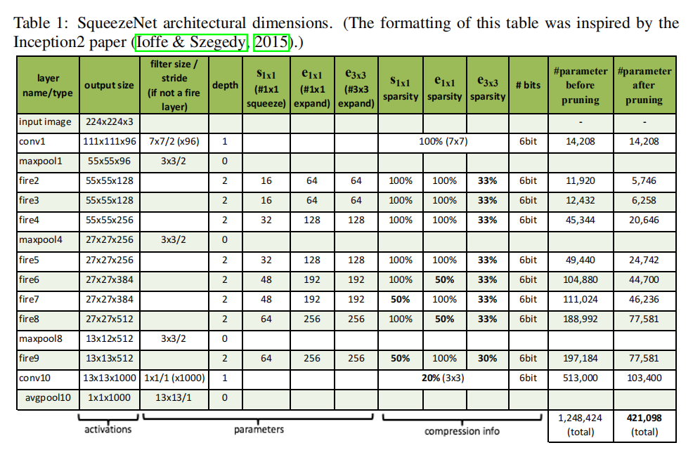
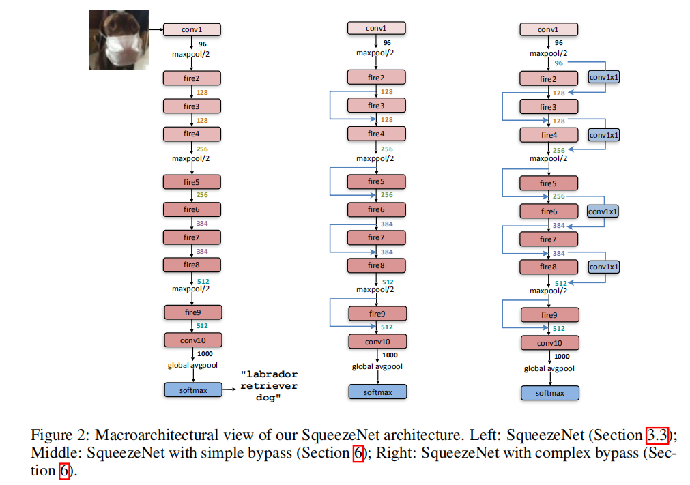

# SQUEEZENET

论文学习：[SQUEEZENET](https://blog.zhujian.life/posts/a2419158.html)

## 定义

`SqueezeNet`包含了`2`个卷积层、`8`个`Fire`模块以及`1`个平均池化层。其实现如下

文章同时介绍了`SqueezeNet+ByPass`模型，也就是在`SqueezeNet`上添加残差连接，其实现如下

## 实现

参考：[squeezenet.py ](https://github.com/pytorch/vision/blob/master/torchvision/models/squeezenet.py)

实现了`Fire`模块和`SqueezeNet`模型

* `py/lib/models/fire.py`
* `py/lib/models/squeeze_net.py`

同时结合残差连接实现`SqueezeNetBypass(SqueezeNet + simply bypass)`

* `py/lib/models/fire_bypass.py`
* `py/lib/models/squeeze_net_bypass.py`

## 训练

比较`AlexNet、SqueezeNet、SqueezeNetBypass`

* 数据集：`voc 07+12`
* 损失函数：交叉熵损失
* 优化器：`Adam`，学习率`1e-3`
* 随步长衰减：每隔`4`轮衰减`5%`，学习因子`0.95`
* 迭代次数：`50`