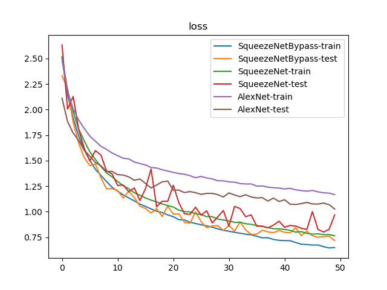
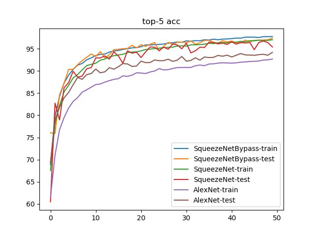

# SQUEEZENET

论文学习：[SQUEEZENET](https://blog.zhujian.life/posts/a2419158.html)

## 定义

`SqueezeNet`包含了`2`个卷积层、`8`个`Fire`模块以及`1`个平均池化层。其实现如下


文章同时介绍了`SqueezeNet+ByPass`模型，也就是在`SqueezeNet`上添加残差连接，其实现如下


## 实现

参考：[squeezenet.py ](https://github.com/pytorch/vision/blob/master/torchvision/models/squeezenet.py)

实现了`Fire`模块和`SqueezeNet`模型

* `py/lib/models/fire.py`
* `py/lib/models/squeeze_net.py`

同时结合残差连接实现`SqueezeNetBypass(SqueezeNet + simply bypass)`

* `py/lib/models/fire_bypass.py`
* `py/lib/models/squeeze_net_bypass.py`

## 训练

比较`AlexNet、SqueezeNet、SqueezeNetBypass`

* 数据集：`voc 07+12`
* 损失函数：交叉熵损失
* 优化器：`Adam`，学习率`1e-3`，权重衰减`1e-4`
* 随步长衰减：每隔`7`轮衰减`4%`，学习因子`0.96`
* 迭代次数：`50`

## 训练结果






训练日志参考[训练日志](./log2.md)

### 检测精度

* `Top-1 Accuracy`
  * `SqueezeNetByPass: 77.54%`
  * `SqueezeNet: 75.46%`
  * `AlexNet: 68.24%`
* `Top-1 Accuracy`
  * `SqueezeNetByPass: 97.41%`
  * `SqueezeNet: 96.78%`
  * `AlexNet: 94.22%`

### Flops和参数数目

```
alexnet: 1.429 GFlops - 233.081 MB
squeezenet: 1.692 GFlops - 4.793 MB
squeezenet-bypass: 1.692 GFlops - 4.793 MB
```

## 小结

| CNN Architecture | Data Type (bit) | Model Size (MB) | GFlops （1080Ti） | Top-1 Acc(VOC 07+12) | Top-5 Acc(VOC 07+12) |
|:----------------:|:---------------:|:---------------:|:-----------------:|:--------------------:|:--------------------:|
|      AlexNet     |        32       |     233.081     |       1.429       |        68.24%        |        94.22%        |
|    SqueezeNet    |        32       |      4.793      |       1.692       |        75.46%        |        96.78%        |
| SqueezeNetBypass |        32       |      4.793      |       1.692       |        77.54%        |        97.41%        |